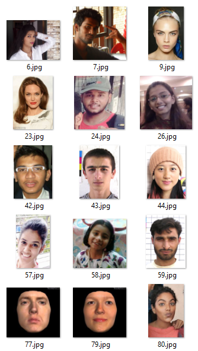
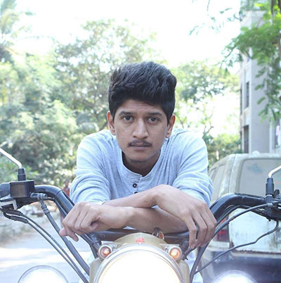
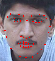
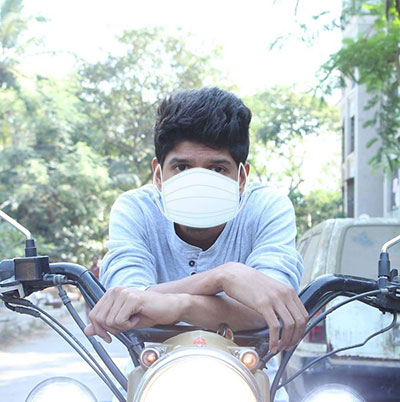

# Face Mask Detector with Deep Learning
Implementation of Face Mask Detector with OpenCV, Keras/TensorFlow, and Deep Learning

## Purpose &amp; Application

The purpose of this system is to implement custom deep learning model to detect person with mask, or person with no mask.

Typical application is to implement on mobile for personal safety (static images), and monitor crowds during COVID-19 pandemic (video stream).

## Two-Phase Mask Detector

**Phase 1**
- Load face mask dataset
- Train face mask classifier with Keras/Tensorflow
- Serialize face mask classifier to disk

**Phase 2**
- Load face mask classifier from disk
- Detect faces in image/video stream
- Extract each face region of interest (ROI)
- Apply classifier to each face ROI to determine “mask” or “no mask”
- Show results

## Dataset

Publicly available [images dataset](https://github.com/prajnasb/observations/tree/master/experiements/data) is used to train the model. It contain 1,376 images belonging to two classes: 690 images *with_mask* and 686 images *without_mask*.

It is pertinent to note that person with masks are different from person without mask, otherwise model becomes heavily biased and fails to generalize.

### How is dataset created?

- Take image of person without mask
- Find facial landmarks (eyes, eyebrows, nose, mouth, jawline)
- Apply mask to facial landmark ROI

**Images without Mask**



**Images with Mask**


### Steps to Create Dataset

Get image of person without mask



Compute bounding box location of face


Face ROI


Apply landmarks to localize eyes, nose, mouth, etc



Overlay mask on detected facial landmarks


Image of person with mask



## Model

MobileNetV2 is a general architecture
- can use different input layer size and different width factors
- reduces inference cost on mobile devices
- highly efficient on embedded devices with low computation

Similar to the original MobileNet
- lower parameter count than the original MobileNet
- supports any input size greater than 32 x 32
- larger image sizes offer better performance

## Implementation

Uses `tensorflow.keras`
- Date augmentation (rotate, zoom, height/width shift, shear, horizontal flip)
- Load MobileNetV2 classifier (with fine-tuned ImageNet weights)
- Build fully-connected head
- Pre-processing (resize image to 224×224 pixels, conversion to array format, scaling the pixel intensities in the input image to the range [-1, 1])
- Loading image data

Uses `sklearn`
- Apply binary class labels
- Split dataset (80% training data, 20% test data, shuffle data before splitting)
- Print classification report

Uses `imutils` to find and list image in dataset

Uses `matplotlib` to plot training loss and accuracy curves

## Hyper-Parameters

- Initial learning rate: 10<sup>-5</sup>
- Epochs: 20
- Batch size: 32

## Custom MobileNetV2 architecture

Image input: 224x224 (3-channel)

Default fully connected layer of MobileNetV2 is not used

Custom implementation of fully connected layers
- Pool size: 7x7
- Dense layer: 128 units, activation: ReLU
- Dropout rate: 0.5
- Dense layer: 2 units, activation: Softmax

Training parameters

- Loss function: binary cross entropy (binary output i.e. “mask” or “no mask”)
- Optimizer: Adam (computationally efficient, little memory requirement)
- Metrics: accuracy

## How to run code

First, make sure required modules are install by running, then follow 3-steps given below to train and predict mask in static image or video stream.

```shell script
pip install -r requirements.txt
```

**Step 1:** Train model

```shell script
python train_mask_detector.py --dataset dataset
```

**Step 2:** Detect face mask in static image

```shell script
python detect_mask_image.py --image examples/example_01.png
```

**Step 3:** Detect face mask in video stream

```shell script
python detect_mask_video.py
```

## System Specification

| Infrastructure | Specification |
| --- | --- |
| Operation System | Windows 10 Pro (64-bit) |
| Processor | Intel® Core™ i7-5500 CPU @ 2.4 GHz |
| RAM | 16 GB |
| GPU | GeForce 830M (2 GB), Compute Capability 5.0 |
| CUDA | Toolkit version 10.1.243, Driver version 446.14 |

## Classification Report

| &nbsp; | Loss | Accuracy |
| --- | ---: | ---: |
| **Training** | 0.1037 | 0.9747 |
| **Validation** | 0.0656 | 0.9891 |


## Limitations

| Limitation | Reason | Way Forward |
| --- | --- | --- |
| Size of dataset | 1,376 images is not enough to apply this train model in production. | Larger dataset is required and retraining of model will overcome this limitation. |
| Face mask is not detected | Facial landmark ROI is basis of face detection, if face is mostly hidden behind mask then model may show false negative. | Diverse images with mask are required to overcome this limitation. |
| Artificially created images with mask | Public dataset of images with mask is not available. | Create a dataset containing real images with masks, and retrain model. |
